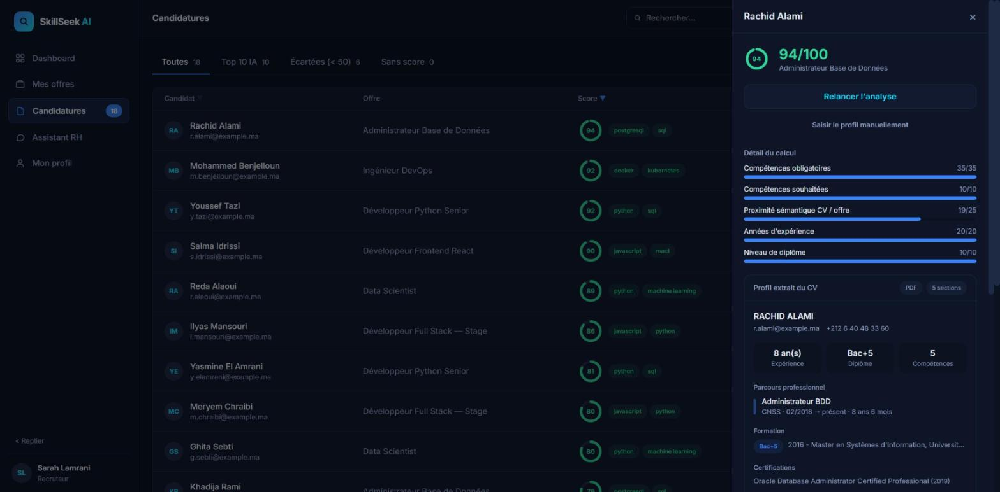

# SkillSeek AI

**Plateforme de présélection de candidatures dont chaque note est justifiable.**

[](https://github.com/AyMB1303/skillseek-ai/actions/workflows/ci.yml)
[](https://github.com/AyMB1303/skillseek-ai/actions/workflows/codeql.yml)
[](https://scorecard.dev/viewer/?uri=github.com/AyMB1303/skillseek-ai)
[](https://sonarcloud.io/summary/new_code?id=AyMB1303_skillseek-ai)

[](https://sonarcloud.io/summary/new_code?id=AyMB1303_skillseek-ai)
[](https://sonarcloud.io/summary/new_code?id=AyMB1303_skillseek-ai)
[](https://sonarcloud.io/summary/new_code?id=AyMB1303_skillseek-ai)
[](https://sonarcloud.io/summary/new_code?id=AyMB1303_skillseek-ai)
[](https://sonarcloud.io/summary/new_code?id=AyMB1303_skillseek-ai)


[](https://codespaces.new/AyMB1303/skillseek-ai)

**Essayer sans rien installer :** le bouton ci-dessus lève la plateforme
entière dans le navigateur — base de données, API et interface — avec un jeu
de démonstration déjà chargé. Comptez une dizaine de minutes au premier
démarrage, le temps de construire les images. Ouvrez ensuite le port 3000
depuis l'onglet « Ports ».

Un recruteur reçoit deux cents candidatures pour un poste. Les outils courants
lui rendent un classement sans lui dire pourquoi. SkillSeek AI fait l'inverse :
il lit chaque CV, le confronte à l'offre, et **restitue le détail du calcul** —
quelles compétences ont été trouvées, lesquelles manquent, et ce qui a fait
écarter un dossier.

Le principe qui gouverne le projet : **le système propose, l'humain tranche.**
Aucune candidature n'est supprimée, toute décision est motivée, et une note
contestée peut être reconstituée six mois plus tard.



---

## Ce que fait la plateforme

**Pour le candidat.** Il déclare ses compétences, son expérience et son diplôme ;
les offres lui sont présentées par proximité décroissante avec son profil. Il
voit les **compétences qui lui manquent** pour chaque offre — la seule chose
qu'il puisse corriger. *Aucune note ne lui est jamais communiquée* : un chiffre
sans son barème invite au malentendu.

**Pour le recruteur.** Chaque candidature reçoit une note sur 100, décomposée en
cinq composantes traçables, accompagnée du motif d'écartement s'il y a lieu. Un
écran d'analyse mesure ensuite si le classement tient ses promesses, en
confrontant la note calculée *avant* l'entretien au verdict porté *après*.

**Pour l'administrateur.** Validation des comptes recruteurs, gestion des rôles
et permissions, journal d'audit immuable, corbeille réversible.

## Comment la note est calculée

| Composante | Poids |
|---|---|
| Compétences obligatoires | 35 |
| Compétences souhaitées | 10 |
| Proximité sémantique avec l'offre | 25 |
| Expérience | 20 |
| Diplôme | 10 |

Un modèle d'apprentissage supervisé ajuste ensuite la note de **±8 points au
maximum**. Il ne peut jamais rattraper une candidature écartée par une règle
explicite, et son absence n'empêche aucune analyse d'aboutir.

**Une compétence écrite ne vaut pas une compétence exercée.** Un curriculum
énonce ses compétences à deux endroits qui n'ont pas la même valeur de preuve :
une rubrique déclarative, où il suffit d'écrire le mot, et le récit des postes
occupés, où la compétence apparaît en train d'être pratiquée. Une compétence
*démontrée* compte pleinement ; une compétence seulement *citée* compte pour
**65 %**. L'écran affiche les deux états distinctement — un écart de points
sans cause lisible est exactement ce qu'on reproche aux dispositifs opaques.

Ce coefficient n'est pas choisi au jugé : `backend/mesurer_credit.py` le
balaie et publie le tableau complet.

**Règle de présélection.** En dessous de 50, la candidature est écartée du
classement — jamais supprimée, et toujours repêchable. Parmi celles au-dessus,
les dix meilleures forment la présélection. Le seuil de 50 **maximise le F1**
sur le jeu de validation, critère fixé avant d'en lire les résultats.

## Ce que le moteur vaut, mesuré

Un outil qui se dit justifiable doit publier ses chiffres. `mesurer_indicateurs.py`
applique le dispositif complet — lecture du document, cinq composantes,
ajustement, règle RG-01 — à **72 appariements curriculum–offre** couvrant huit
domaines, et confronte chaque décision à l'issue attendue.

Le jeu se lit selon **deux protocoles**, et l'écart entre eux est le résultat
qui compte :

| Protocole | Négatifs | Précision | Rappel | F1 |
|---|---|---|---|---|
| Profils d'un autre domaine | 32 | 100 % | 93,8 % | 0,968 |
| + huit négatifs *difficiles* | 40 | **85,7 %** | **93,8 %** | **0,896** |

Une précision parfaite mesure rarement la qualité d'un moteur : elle mesure la
facilité de l'épreuve. Le second protocole est donc plus dur que ce que le
cahier des charges demandait — un négatif difficile est un profil **du domaine
de l'offre**, qui satisfait l'expérience et le diplôme et emploie tout le
vocabulaire attendu, mais dont le parcours réel ne correspond pas au poste.
**Cinq sur huit passent encore.** C'est l'angle mort du dispositif, il est
structurel pour toute lecture fondée sur le texte du curriculum, et c'est
précisément pourquoi le détail du calcul est affiché et la décision laissée à
un humain.

**Audit de biais par perturbation contrôlée.** Un même curriculum est présenté
plusieurs fois à la même offre, un seul attribut changeant d'une version à
l'autre ; le contenu professionnel reste identique, donc tout écart lui est
imputable.

| Attribut | Écart maximal | Écart moyen |
|---|---|---|
| Genre du prénom | 1 pt | 0,6 |
| Origine apparente du nom | 2 pt | 1,2 |
| Âge déclaré | 1 pt | 0,2 |
| Réputation de l'établissement | 1 pt | 0,2 |

Deux points sur cent au pire, très en deçà du seuil : aucune de ces variations
ne fait basculer une décision. L'écart vient de la composante sémantique, qui
encode le document entier, identité comprise — raison supplémentaire de l'avoir
plafonnée à 25 points.

> Ces chiffres sont mesurés sur un jeu construit, dont huit cas ont guidé le
> développement. C'est une **borne haute**, pas une estimation de terrain :
> les confronter à de vrais dossiers écartés par un recruteur reste la
> vérification qui manque.

## Deux propriétés que le code garantit

**Le cloisonnement par périmètre.** Les permissions répondent à « ce rôle
peut-il consulter des candidatures ? ». Elles ne répondent pas à « celle-ci ? ».
Deux recruteurs ont exactement les mêmes droits ; ce qui les sépare est la
chaîne de propriété recruteur → offre → candidature → CV. La vérification est
centralisée dans `backend/app/services/acces.py`, et onze tests écrits **du
point de vue de l'attaquant** échouent si elle est omise.

**Les permissions en temps réel.** Elles sont relues en base à chaque requête
sensible. Retirer un droit prend effet immédiatement, sans attendre
l'expiration des sessions ouvertes. Le rôle administrateur ne bénéficie
d'aucun contournement.

**Le modèle d'accès se relève au lieu de se recopier.** Chaque garde inscrit
sur sa route la permission qu'elle exige, et le contrat OpenAPI publié par
l'application — `/api/openapi.json`, lisible sur `/api/docs` — relève ces
marques dans le code au lieu d'en tenir une liste à la main. Sur 66 routes, 59
demandent un jeton ; les 7 ouvertes sont l'inscription, la connexion, deux
sondes d'état, la page d'indicateurs et le contrat lui-même, dont aucune ne
livre de donnée. **Un test échoue si une route s'ajoute à cette liste** —
l'oubli le plus silencieux qui soit, une route sans garde fonctionnant
parfaitement.

---

## Démarrage local

```bash
git clone https://github.com/AyMB1303/skillseek-ai.git
cd skillseek-ai
cp .env.example .env          # Windows : copy .env.example .env

docker compose up -d --build
docker compose exec backend flask db upgrade
docker compose exec backend flask seed
docker compose exec backend flask demo --reset
```

L'interface répond sur **http://localhost:3000**, l'API sur
**http://localhost:5000/api**.

`docker-compose.override.yml` est chargé automatiquement : le frontend démarre
en rechargement à chaud et le backend en mode debug. Rien d'autre à lancer.

### Comptes de démonstration

| Rôle | Identifiant | Mot de passe |
|---|---|---|
| Candidat | `y.tazi@example.ma` | `Demo@1234` |
| Recruteur | `s.lamrani@bcskills.ma` | `Demo@1234` |
| Administrateur | `admin@skillseek.local` | `Admin@1234` |

### Tests

```bash
cd backend
pip install -r requirements.txt
flake8 app tests
pytest -q                     # 281 tests, dont 11 de cloisonnement
```

### Reproduire les mesures

Les chiffres publiés plus haut se refont en deux commandes, la pile étant
démarrée. Elles n'écrivent rien dans la base :

```bash
docker compose exec backend python mesurer_indicateurs.py   # précision, rappel, biais
docker compose exec backend python mesurer_credit.py        # balayage du crédit
```

---

## Architecture

```
backend/app/
  blueprints/     61 routes HTTP — reçoivent, délèguent, répondent
                  (66 au total avec les sondes d'état et le contrat d'API)
  services/       le raisonnement métier, sans dépendance à HTTP
  models/         une classe par table (SQLAlchemy)
  middleware/     contrôle des permissions
frontend/src/
  pages/          22 écrans (un fichier = une URL)
  components/     éléments partagés
  lib/            appels API, thème, animations
.github/workflows/
  ci.yml          10 travaux d'intégration continue
deploiement/
  aci/            script de déploiement Container Instances
  terraform/      la même infrastructure, décrite et reproductible
k8s/
  base/           manifestes communs aux deux environnements
  overlays/       ce qui distingue développement et production
```

**La séparation `blueprints` / `services` est délibérée.** Les services ignorent
qu'HTTP existe : ils prennent des objets Python et en rendent. C'est ce qui
permet de tester le moteur de notation sans démarrer de serveur web.

### Pile technique

Flask 3 · SQLAlchemy · PostgreSQL 16 · Alembic · JWT · bcrypt
Next.js 14 · React 18 · Tailwind CSS
spaCy · sentence-transformers · scikit-learn · Tesseract OCR
Docker · GitHub Actions · Terraform · Kubernetes · Kustomize
Trivy · Bandit · Semgrep · CodeQL · Gitleaks · OWASP ZAP

### Chaîne d'intégration continue

Dix travaux à chaque poussée : analyse statique et tests du service applicatif,
analyse statique et construction de l'interface, audit des dépendances des deux
écosystèmes, **validation de l'infrastructure** (Terraform) et des **manifestes
Kubernetes**, **recherche de secrets dans tout l'historique Git** (Gitleaks),
analyse du dépôt (Trivy), **analyse de sûreté du code** (Bandit et Semgrep),
construction et publication des images avec leur inventaire logiciel et leur
signature, et démarrage de la pile complète.

Les images sont étiquetées par l'empreinte du commit qui les a produites :
chaque état du code correspond à un artefact déployable et identifiable.

**Quatre analyseurs, quatre angles différents.** Trivy inspecte les
dépendances et les images ; Bandit lit l'arbre syntaxique Python ; Semgrep
couvre les deux écosystèmes par motifs ; **CodeQL suit le chemin des données**
— il repère qu'une valeur entrée par un utilisateur atteint une requête ou un
chemin de fichier après avoir traversé plusieurs fonctions, ce qu'aucune
analyse ligne par ligne ne peut voir. Il s'exécute aussi une fois par semaine
sans changement de code, les règles évoluant indépendamment du projet.

### Déploiement

Poser une étiquette de version déclenche la chaîne complète, sans aucune
commande manuelle :

```bash
git tag v1.0.0 && git push origin v1.0.0
```

Les images sont construites et publiées, puis un second workflow attend leur
disponibilité au registre, crée le groupe de conteneurs sur **Azure Container
Instances**, et **interroge `/api/ready` depuis l'extérieur**. L'exécution n'est
déclarée réussie que si le service répond — pas parce qu'une commande a rendu
la main.

Le recours aux conteneurs plutôt qu'à une machine virtuelle découle d'une
contrainte de l'abonnement académique utilisé, dont la politique de régions et
les quotas de processeurs n'autorisaient aucune instance dans les familles
proposées. Le détail figure dans
[`docs/DEPLOIEMENT_AZURE.md`](docs/DEPLOIEMENT_AZURE.md).

#### Second chemin : un cluster Kubernetes sur Azure

Quatre conteneurs sur une seule machine ne se répliquent pas, ne se remplacent
pas sans coupure, et rien ne les redémarre selon un critère de santé. La
plateforme tourne donc aussi sur un **cluster Kubernetes à deux nœuds**, monté
par une seule commande :

```bash
bash deploiement/deployer-azure.sh
```

Six étapes, chacune reprenable après une erreur :

| Étape | Outil | Ce qu'elle produit |
|---|---|---|
| Machines et réseau | **Terraform** | Réseau virtuel, groupe de sécurité, deux machines — onze ressources |
| Cluster | **Ansible** | k3s installé, plan de contrôle marqué comme non ordonnançable |
| Point d'entrée | `kubectl` | Contrôleur d'entrée sur les ports du nœud, sans équilibreur de charge |
| Plateforme | **Kustomize** | Manifestes de `k8s/overlays/azure` |
| Rattachement | **Azure Arc** | Le cluster devient une ressource de l'abonnement |
| Réconciliation | **Flux** | Git devient l'état de référence |

Le service Kubernetes infogéré d'Azure n'était pas utilisable : sa liste de
tailles de machines acceptées et le quota de l'abonnement académique ont une
intersection vide, dans les neuf régions autorisées. Les machines ordinaires
relèvent d'un quota distinct — d'où un cluster auto-géré, sur la même
distribution que celle du développement local.

La séparation entre les deux outils d'infrastructure n'est pas une question de
goût : **Terraform répond à « quelles machines existent », Ansible à « que
contiennent-elles »**. Les mêler produit un ensemble qu'on ne peut plus rejouer
partiellement.

Une fois Flux en place, la chaîne de livraison ne détient plus aucun secret
permettant de joindre le serveur d'API : elle pousse un commit, et le cluster
va chercher ce qu'il doit être. Le sens du flux s'inverse, et avec lui la
surface d'attaque.

Les instances de démonstration sont libérées après validation : le crédit
disponible est limité, et une ressource inutilisée n'a pas à tourner.
L'infrastructure étant décrite, une commande la reconstruit à l'identique.

---

## État du projet

Le périmètre fonctionnel est **complet**. Ce qui manque figure ici sans être
déguisé en perspective :

- **Pas de tests de bout en bout** en navigateur. 281 tests automatisés couvrent
  le raisonnement métier, pas l'enchaînement des écrans. Les parcours des trois
  profils sont parcourus par un script Playwright qui **filme** la plateforme
  et vérifie que chaque écran s'ouvre — c'est une démonstration reproductible,
  pas une suite de tests : rien n'y échoue sur une assertion.
- **Pas de métrologie centralisée** — le chronométrage est conservé avec chaque
  analyse, mais il n'existe ni collecte ni système d'alerte. Sans trafic réel,
  l'intérêt en resterait théorique.
- **Le moteur lit le vocabulaire plus que la substance.** Cinq négatifs
  difficiles sur huit sont encore retenus. La distinction entre compétence
  démontrée et compétence citée réduit l'écart sans le fermer ; la lever
  demanderait de lire le récit des postes, pas de régler un paramètre.
- **Audit de biais de portée limitée** — deux points de variation au pire.
  Négligeable, mais réel : la formule « sans biais » serait fausse.
- **Le cluster n'a pas été éprouvé dans la durée.** La topologie, le
  cloisonnement réseau, la persistance et l'auto-réparation ont été vérifiés sur
  le cluster Azure, mais la fenêtre d'exécution s'est comptée en heures, sur le
  crédit disponible, et sans trafic réel : la règle de montée en charge n'a
  jamais été déclenchée par autre chose que sa propre définition.

## Documentation

| Document | Contenu |
|---|---|
| [`docs/ANALYSE_ATS.md`](docs/ANALYSE_ATS.md) | lecture des CV, reconstitution du profil structuré |
| [`docs/ASSISTANT_RAG.md`](docs/ASSISTANT_RAG.md) | assistant conversationnel, bases de connaissances |
| [`docs/CI_CD.md`](docs/CI_CD.md) | détail des dix travaux et des six contrôles de sûreté |
| [`docs/DEPLOIEMENT_AZURE.md`](docs/DEPLOIEMENT_AZURE.md) | déploiement, contraintes de l'abonnement |
| [`docs/DEVOPS.md`](docs/DEVOPS.md) | conteneurisation, images, exploitation |
| [`bi/GUIDE_POWER_BI.md`](bi/GUIDE_POWER_BI.md) | vues décisionnelles |

---

## Contexte

Projet de fin d'année (PFA) réalisé au sein de **BC SKILLS**, juillet–août 2026.

**Aymen Benrbib** — École des Sciences de l'Information (ESI), filière
Ingénierie des Systèmes d'Information et Transformation Digitale.

Développé sur quatre sprints : socle technique et sécurité, interface et
parcours métier, moteur d'analyse et de notation, apprentissage supervisé et
industrialisation.

Code publié à des fins pédagogiques et de démonstration.
